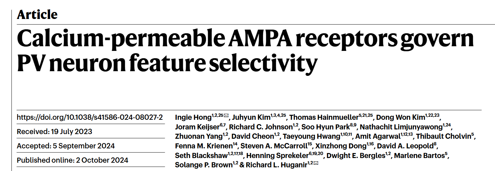

# PV selectivity
Neural network models for Hong et al., [Calcium-permeable AMPA receptors govern PV neuron feature selectivity](https://www.nature.com/articles/s41586-024-08027-2), Nature, 2024-10.




## Setup
This software has been tested on Ubuntu 18.04 & 22.04. The human & machine-readable `environment.yml` contains the necessary software versions. 
`environment_compatibility.yml` is included for Windows 11 installation.
Install virtual environment using Mamba (or Conda; this will take a few minutes):
```
mamba env create --name pv --file environment.yml
mamba activate pv # necessary before running the code 
```
Next, install the project package to make the `src/` files available: 
```
pip install -e .
```

## Running the code
Scripts are named after the figure panels they reproduce. To create, e.g., the first panels of Figure 5, run:
```
python scripts/fig5abc_network.py
```
This will save the simulation output `figures/` and `results/`. Running each script should take a minute at most. 

Most simulations are stand-alone, but the supplementary figures
rely on data. Running the simulations on your data requires IV curves for two conditions (e.g., WT and KO),
saved in `data/`. 

