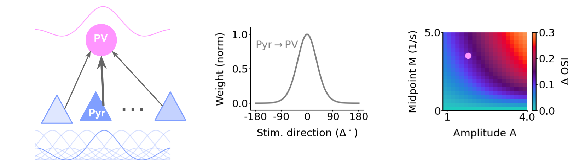

# PV selectivity
Neural network models for Hong et al., [Calcium-permeable AMPA receptors govern PV neuron feature selectivity](https://doi.org/10.1101/2023.07.20.549908).
> Hong, I., ... & Huganir, R. L. (2023). Calcium-permeable AMPA receptors govern PV neuron feature selectivity. bioRxiv, 2023-07.




## Setup
Install virtual environment using Mamba (or Conda):
```
mamba env create --name pv --file environment.yml
mamba activate pv
```
Install project package:
```
pip install -e .
```
